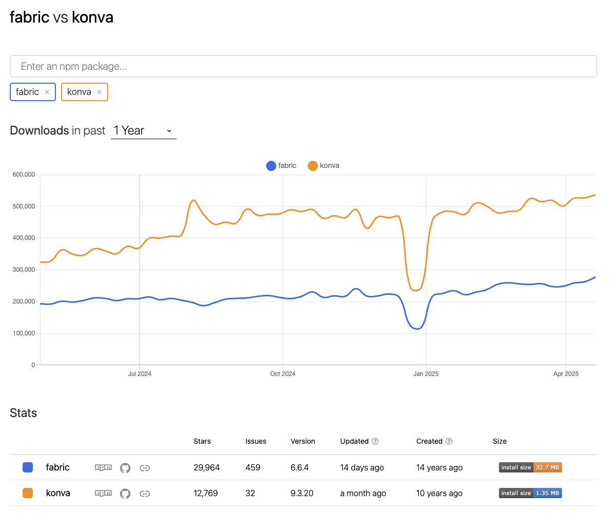

# 🖌️ Fabric.js vs Konva.js 비교 프로젝트

이 프로젝트는 HTML5 Canvas 기반 드로잉 라이브러리인 [Fabric.js](https://fabricjs.com/)와 [Konva.js](https://konvajs.org/)의 기능을 React + Next.js 환경에서 비교하기 위해 제작되었습니다.

각 라이브러리는 드로잉, 도형 생성, 이벤트 처리, 애니메이션 등 다양한 기능을 제공하며, 목적에 따라 선택이 달라질 수 있습니다.

---

## 📋 프로젝트 목적

- Fabric.js와 Konva.js의 최신 기능 및 개발 방식 비교
- React 환경에서 각각의 통합 방식 실습
- 펜, 원, 화살표, 지우개 도구 구현을 통해 사용성 및 퍼포먼스 체험
- 디자인 툴 또는 드로잉 서비스 개발 시 기술 선택에 도움 제공

---

## ⭐️ [Npm trends](https://npmtrends.com/fabric-vs-konva)

---

## 📦 기능 비교

| 항목                    | Fabric.js (v6.6.4)                       | Konva.js (v9.3.20)                         |
| ----------------------- | ---------------------------------------- | ------------------------------------------ |
| React 공식 연동 지원    | ❌ 직접 DOM 제어 필요                    | ✅ `react-konva` 공식 패키지 제공          |
| 도형 지원               | ✅ 사각형, 원, 다각형, 텍스트, 이미지 등 | ✅ 선, 원, 화살표, 텍스트, 이미지 등       |
| SVG import/export       | ✅ 완벽 지원                             | ✅ import만 지원                           |
| 텍스트 스타일링         | ✅ 고급 스타일, 경로 따라가기 등 가능    | ❌ 제한적                                  |
| 그룹화 및 객체 조작     | ✅ 그룹/복제/회전 등 객체 단위 조작 용이 | ✅ 계층 기반 객체 구조 지원                |
| 이벤트 처리             | ✅ 객체마다 개별 이벤트 등록 가능        | ✅ 객체 및 Stage 단위로 이벤트 핸들링 가능 |
| 애니메이션              | ❌ 직접 구현 필요                        | ✅ `.to()` 기반 애니메이션 API 내장        |
| 성능 (대규모 객체 처리) | 보통 (객체 많을 경우 느려질 수 있음)     | 우수 (Layer 및 batchDraw 지원)             |
| 이미지 필터             | ✅ WebGL 기반 다양한 필터 지원           | ✅ 기본 필터 일부 제공                     |
| TypeScript 지원         | 보완 중 (타입이 점점 개선됨)             | ✅ 강력한 타입 지원                        |

---

## 🧠 어떤 라이브러리를 선택할까?

| 선택 기준                               | 추천 라이브러리 |
| --------------------------------------- | --------------- |
| 객체 편집, 그룹화, SVG 편집이 중요할 때 | **Fabric.js**   |
| React 프로젝트와 자연스럽게 통합할 때   | **Konva.js**    |
| 고성능 애니메이션, 계층 기반 구조 필요  | **Konva.js**    |
| 포토샵/에디터 스타일 UI 구성            | **Fabric.js**   |

---

## 💡 실사용자 관점에서 느낀 차이점

Fabric.js와 Konva.js를 직접 구현하며 느낀 사용성의 차이를 정리합니다.

---

### 1. 📚 문서 친절도: Konva는 React 중심, Fabric은 imperative 중심

- Konva는 공식적으로 [`react-konva`](https://github.com/konvajs/react-konva)를 제공하며, 컴포넌트 기반으로 사용할 수 있어 **React 개발자에게 익숙하고 친화적인 구조**입니다.
- 공식 문서 또한 React 사용자를 위한 예제와 가이드가 명확하게 제공되어 있어 빠르게 접근할 수 있습니다.
- 반면, Fabric.js는 데모는 많지만 **React 기반 통합에 대한 안내는 거의 없고**, imperative 방식(`useRef`, 직접 canvas 조작)에 의존합니다.
- API 문서는 풍부하나 **복잡한 기능 구현에 있어 예제가 부족하거나 코드 레벨로 직접 확인해야 하는 경우가 많습니다.**

---

### 2. 🧱 객체 구조의 차이로 인한 체감 UX 차이

- **Fabric.js**는 모든 도형이 객체화되어 있으며, 기본적으로 선택, 이동, 크기 조절 등이 내장되어 있습니다.
  - 예: 원을 그리고 나면 자동으로 선택되어 마우스로 이동/확대/회전이 자연스럽게 가능합니다.
- **Konva.js**는 객체를 직접 그리긴 하지만, 이동이나 선택, 트랜스폼을 위해서는 `draggable`, `Transformer` 등을 **명시적으로 설정**해야 합니다.
  - 설정을 하지 않으면 단순히 "그려지는 캔버스"로만 동작하며, 사용자 조작은 동작하지 않습니다.

---

### 3. 🧽 지우개(삭제) 기능의 차이

- Fabric.js는 객체 기반이기 때문에, **특정 도형 하나를 선택하고 삭제하는 방식이 기본입니다.**
- Konva.js는 도형 자체를 지우기보다는 **브러시처럼 ‘캔버스를 덮어 씌우는 방식’으로 지웁니다.**
  - 즉, Konva에서의 지우개는 실제 도형 삭제라기보다 캔버스 픽셀을 "덧칠"하는 느낌에 가깝습니다.

---

### ✅ 요약 비교

| 항목        | Fabric.js                          | Konva.js                                        |
| ----------- | ---------------------------------- | ----------------------------------------------- |
| 문서 친절도 | ❌ React 통합 가이드 부족          | ✅ React 기반 문서와 예제 잘 구성됨             |
| 객체 조작   | ✅ 기본 제공 (선택, 이동, 확대 등) | ❌ 수동 설정 필요 (`draggable`, Transformer 등) |
| 삭제 방식   | ✅ 객체 단위 삭제                  | ❌ 그림판처럼 덮어씌우는 방식                   |
| 사용성 체감 | **에디터에 적합 (포토샵 느낌)**    | **드로잉 툴에 적합 (그림판 느낌)**              |

---

_이 비교는 실제 프로젝트에서 각 도구를 활용하며 느낀 경험을 바탕으로 작성되었습니다._

---

## 📚 참고 자료

- [Fabric.js 공식 문서](https://fabricjs.com/)
- [Konva.js 공식 문서](https://konvajs.org/)
- [react-konva GitHub](https://github.com/konvajs/react-konva)
- [comparison of canvas libraries](https://dev.to/lico/react-comparison-of-js-canvas-libraries-konvajs-vs-fabricjs-1dan)

---

이 문서는 **Fabric.js v6.6.4**와 **Konva.js v9.3.20**을 기준으로 작성되었습니다.

# fabric-konva-example
